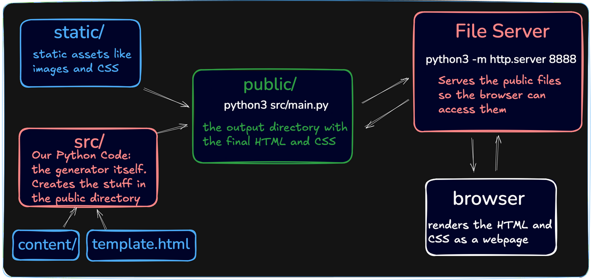

# Static Site Generator

Converts Markdown files into a static website. Built in Python from scratch as a [Boot.dev](https://www.boot.dev/courses/build-static-site-generator-python) project.



## How it works

`src/main.py` recursively walks `content/`, parses each Markdown file into an HTML node tree, injects the result into `template.html`, copies over `static/` assets, and writes everything to `public/`. `main.sh` runs the generator then spins up Python's built-in HTTP server on port 8888 to serve the output.

## Usage

```bash
./main.sh
# open http://localhost:8888
```

## What I learned

- Building a Markdown parser by hand — tokenizing inline elements (bold, italic, links, code) and block elements (headings, paragraphs, lists, quotes)
- HTML templating — injecting generated content into a base layout
- Representing document structure as a tree of HTML nodes and recursively rendering them to strings
- How static site generators like Jekyll and Hugo work under the hood
- Recursive file system traversal to process nested content directories
- Test-Driven Development with `test.sh`
